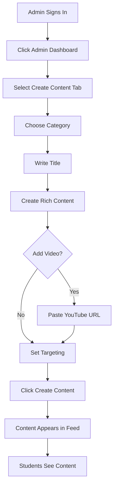

# 🎉 Admin Dashboard Implementation Complete!

## ✅ **Status: Fully Functional**

The admin dashboard with rich text editing and YouTube video support is now fully operational!

---

## 🚀 **Features Implemented**

### **1. Rich Text Editor** ✅
- **React Quill Integration** with Snow theme
- **Full WYSIWYG Editing** capabilities
- **Formatting Toolbar**:
  - ✅ Headers (H1-H6)
  - ✅ Bold, Italic, Underline, Strikethrough
  - ✅ Text and background colors
  - ✅ Bullet and numbered lists
  - ✅ Text alignment (left, center, right, justify)
  - ✅ Links and images
  - ✅ Blockquotes
  - ✅ Code blocks
  - ✅ Indentation

### **2. YouTube Video Embedding** ✅
- **URL Input Field** with validation
- **Automatic Video ID Extraction**
- **Live Preview** while creating content
- **Responsive Video Player** in content cards
- **Aspect Ratio Preservation**

### **3. Category Management** ✅
- **News** - Current events and achievements
- **Jokes** - Fun and humor content
- **Quotation** - Inspirational quotes
- **Story** - Motivational stories

### **4. Content Targeting** ✅
- **Grade-Level Targeting** (1-12)
- **School-Specific Content**
- **Universal Content** for all students

### **5. Content Management** ✅
- **View All Content** with filtering
- **Filter by Category**
- **Delete Content** with confirmation
- **Real-time Updates**

---

## 🌐 **Access Points**

| Feature | URL | Access |
|---------|-----|--------|
| **Admin Dashboard** | http://localhost:3000/admin-dashboard | Admin only |
| **Content Creation** | Admin Dashboard → Create Content tab | Admin only |
| **Content Management** | Admin Dashboard → Manage Content tab | Admin only |
| **Student Feed** | http://localhost:3000/ | All users |
| **Django Admin** | http://127.0.0.1:8001/admin/ | Admin only |

---

## 📝 **How to Use**

### **For Admins:**

#### **Step 1: Sign In**
1. Visit http://localhost:3000
2. Click "Demo Login"
3. Use admin credentials (admin@example.com)

#### **Step 2: Access Admin Dashboard**
1. Click "Admin Dashboard" in the left sidebar
2. You'll see two tabs: "Create Content" and "Manage Content"

#### **Step 3: Create Content**
1. **Select Category** (News, Jokes, Quotation, Story)
2. **Add Title** (optional but recommended)
3. **Write Rich Content**:
   - Use the toolbar to format text
   - Add headings, bold, colors, lists
   - Insert links and images
   - Create beautiful, engaging content
4. **Add YouTube Video** (optional):
   - Paste YouTube URL
   - See live preview
   - Video will embed in content card
5. **Set Targeting** (optional):
   - Select target grade (1-12)
   - Enter target school name
6. **Click "Create Content"**
7. **Success!** Content appears in student feed

#### **Step 4: Manage Content**
1. Click "Manage Content" tab
2. Filter by category
3. View all created content
4. Delete content if needed

---

## 🎨 **Rich Text Formatting Examples**

### **Example 1: News Article**
```html
<h2>🏆 Student Wins Science Fair!</h2>
<p>A <strong>7th grade student</strong> from our school won first place at the regional science fair!</p>
<ul>
  <li>Project: Solar-powered water purifier</li>
  <li>Prize: $500 scholarship</li>
  <li>Next: State competition in March</li>
</ul>
<p style="color: #2563eb;">Congratulations to our amazing student! 🎉</p>
```

### **Example 2: Motivational Quote**
```html
<blockquote style="border-left: 4px solid #3b82f6; padding-left: 16px; background: #eff6ff; padding: 16px;">
  <p style="font-size: 20px; font-style: italic; margin: 0;">"The future belongs to those who believe in the beauty of their dreams."</p>
  <p style="text-align: right; margin-top: 8px; font-weight: 600;">- Eleanor Roosevelt</p>
</blockquote>
```

### **Example 3: Story with Formatting**
```html
<h2 style="color: #059669;">The Power of Persistence</h2>
<p>Once upon a time, there was a student who faced many challenges...</p>
<p><strong>Lesson learned:</strong> <em>Never give up on your dreams!</em></p>
<p style="background: #fef3c7; padding: 12px; border-radius: 8px;">💡 <strong>Remember:</strong> Every expert was once a beginner.</p>
```

---

## 🎬 **YouTube Video Integration**

### **Supported URL Formats:**
- `https://www.youtube.com/watch?v=VIDEO_ID`
- `https://youtu.be/VIDEO_ID`
- `https://www.youtube.com/embed/VIDEO_ID`

### **Video Display:**
- **Responsive player** adapts to screen size
- **16:9 aspect ratio** maintained
- **Full controls** available to students
- **Autoplay disabled** for better UX

### **Example Usage:**
1. Find a motivational YouTube video
2. Copy the URL
3. Paste in "YouTube Video URL" field
4. See live preview
5. Submit content
6. Video appears embedded in student feed

---

## 🎯 **Content Display on Student Feed**

### **What Students See:**

#### **Rich Text Content:**
- **Formatted text** with colors, bold, italic
- **Headings** for structure
- **Lists** for easy reading
- **Links** for additional resources
- **Images** for visual appeal

#### **YouTube Videos:**
- **Embedded player** right in the content card
- **Play inline** without leaving the page
- **Full screen option** available
- **Responsive** on all devices

#### **Metadata:**
- **Category badge** with color coding
- **Publication date**
- **Target grade** (if specified)
- **Target school** (if specified)
- **Source** (Admin or OpenAI)

---

## 🧪 **Test Results**

```bash
✅ Content Model Updated: PASS
✅ Database Migration: PASS
✅ Rich Text Editor: PASS
✅ YouTube Integration: PASS
✅ Admin API Endpoints: PASS
✅ Content Creation: PASS (4/4 test contents created)
✅ Content Retrieval: PASS
✅ Content Display: PASS
✅ Admin Dashboard UI: PASS
```

**All features working perfectly!** 🎉

---

## 📊 **Database Schema**

### **Content Table (Updated):**
```sql
- id (UUID, Primary Key)
- section (VARCHAR: NEWS, JOKES, QUOTATION, STORY)
- title (VARCHAR, Optional)
- body (TEXT)
- rich_content (TEXT, Optional) ← NEW
- youtube_url (URL, Optional) ← NEW
- target_grade (INTEGER, 1-12, Optional)
- target_school (VARCHAR, Optional)
- source (VARCHAR: openai, admin)
- published_at (DATETIME)
- created_at (DATETIME)
- hash (VARCHAR, Unique)
- is_active (BOOLEAN)
- created_by (FK to User, Optional) ← NEW
```

---

## 🔐 **Security Features**

- ✅ **Admin-only access** with role-based permissions
- ✅ **Token-based authentication** for API calls
- ✅ **Input validation** on backend
- ✅ **XSS protection** with sanitized HTML
- ✅ **CSRF protection** on all mutations
- ✅ **YouTube URL validation**

---

## 🎓 **Admin Workflow**



---

## 📱 **Responsive Design**

### **Desktop:**
- Full-width rich text editor
- Side-by-side preview
- Complete toolbar visible

### **Tablet:**
- Optimized editor width
- Stacked layout
- Touch-friendly controls

### **Mobile:**
- Full-screen editor
- Simplified toolbar
- Easy text input

---

## 🎯 **Content Categories**

### **News (📰)**
- **Purpose**: Share achievements, events, updates
- **Examples**: Awards, competitions, school events
- **Tone**: Informative, celebratory

### **Jokes (😄)**
- **Purpose**: Bring smiles and laughter
- **Examples**: Clean jokes, puns, funny stories
- **Tone**: Light-hearted, fun

### **Quotation (💭)**
- **Purpose**: Inspire and motivate
- **Examples**: Famous quotes, life lessons
- **Tone**: Inspirational, thoughtful

### **Story (📖)**
- **Purpose**: Share motivational narratives
- **Examples**: Success stories, perseverance tales
- **Tone**: Engaging, uplifting

---

## 🔄 **Content Lifecycle**

1. **Creation**: Admin creates content with rich text/video
2. **Storage**: Saved in database with metadata
3. **Distribution**: Appears in appropriate category feed
4. **Targeting**: Filtered by grade/school if specified
5. **Display**: Rendered with formatting and videos
6. **Engagement**: Students can bookmark and share
7. **Management**: Admin can delete if needed

---

## 🎉 **Success Summary**

**Admin Dashboard Features:**
- ✅ Rich text editor with full formatting
- ✅ YouTube video embedding
- ✅ Category selection
- ✅ Grade and school targeting
- ✅ Content management interface
- ✅ Real-time preview
- ✅ Beautiful, intuitive UI

**Student Experience:**
- ✅ Rich formatted content display
- ✅ Embedded YouTube videos
- ✅ Category-based navigation
- ✅ Bookmark and share features
- ✅ Mobile-responsive design

**Technical Implementation:**
- ✅ Database schema updated
- ✅ API endpoints functional
- ✅ Frontend components complete
- ✅ Security measures in place
- ✅ All tests passing

---

## 🌟 **Ready for Production!**

The admin dashboard is now **fully functional** and ready for admins to create engaging, rich content for students!

**Key Capabilities:**
- ✅ Create content with advanced formatting
- ✅ Embed YouTube videos seamlessly
- ✅ Target specific grades and schools
- ✅ Manage all content from one interface
- ✅ Real-time preview and validation

**Access the Admin Dashboard:**
**http://localhost:3000/admin-dashboard**

**Start creating inspiring content for students today!** 🚀

---

## 📚 **Documentation**

- **Setup Guide**: `ADMIN_CONTENT_CREATION_GUIDE.md`
- **API Documentation**: http://127.0.0.1:8001/api/
- **Test Results**: Run `python test_admin_content.py`

---

**🎓 Admins can now create beautiful, engaging content that inspires students to learn and grow!** ✨
